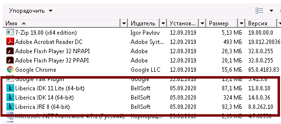

# Ansible Role: Install Liberica Java

[![License][license-image]][license-url] [![Ansible Galaxy][ansible-galaxy-image]][ansible-galaxy-url] [![CircleCI][circleci-image]][circleci-url] [![Ansible Galaxy Quality][ansible-galaxy-quality-image]][ansible-galaxy-url] [![Ansible Galaxy Release][ansible-galaxy-release-image]][ansible-galaxy-url]

Install [Liberica Java](https://bell-sw.com/) for Linux and Windows.

## Work on

### Ansible Galaxy style

```yaml
  platforms:
    - name: Fedora
      versions:
        - 31
        - 32
    - name: Ubuntu
      versions:
        - xenial
        - bionic
        - focal
    - name: Debian
      version:
        - jessie
        - stretch
        - buster
        - oldstable
        - stable
        - testing
    - name: EL (CentOS)
      versions:
        - 8
    - name: opensuse
      vesrion:
        - tumbleweed
        - 15.1
    - name: windows
      version:
        - 2008x64 (7 64bit)
        - 2008x86 (7 32bit)
        - 2019 (10 64bit)
```

## Dependencies

min_ansible_version: 2.9

In Ansible controller: [python-jmespath](https://repology.org/project/python:jmespath)

## Role Variables

```yaml
# https://api.bell-sw.com/api.html
# https://api.bell-sw.com/api.yaml
liberica_api_version: 1
liberica_api_releases_url: https://api.bell-sw.com/v{{ liberica_api_version }}/liberica/releases

liberica_gpg_key_url: https://download.bell-sw.com/pki/GPG-KEY-bellsoft

# If the value is not defined, the last supported LTS will be selected.
# liberica_java_version: 11

# LTS stands for Long Term Support. It means that the release will receive security updates for a long time.
# EOL stands for End Of Life. It means that the release is not supported anymore.
# GA stands for General Availability. It means that the release is stable.
# EA stands for Early Access. It means that the release is not stable.
# Bitness describes 64 or 32-bit architecture.
# Versions: feature, interim, patch and build are described in OpenJDK community document JEP 322

#--- For all ---#
liberica_java_architecture: x86
liberica_java_bundletype: jdk-full
liberica_java_eol: 'false'
liberica_java_lts: 'true'
liberica_java_ga: 'true'
liberica_java_latestlts: 'true'

#--- Windows only ---#
liberica_win_packagetype: msi
liberica_win_installationtype: installer
liberica_win_bitness: 64
liberica_win_architecture: x86

# Custom url with msi-installer
# liberica_win_download_url: http://10.10.10.10/soft/bellsoft/liberica/latestlts/bellsoft-jdk-latest-windows-amd64-full.msi

#--- About bundle type ---#
# https://bell-sw.com/pages/repositories#packages-versioning

# jdk - a regular package that contains the full Liberica JDK, not including JavaFX.
# jdk-full - contains the full Liberica JDK, including JavaFX and a variety of JVMs for platforms that support it.
# jdk-lite - includes Liberica JDK with compressed modules and Server VM, without any extra packages.
# jre - contains Java SE Runtime Environment only.
# jre-full - contains Java SE Runtime Environment, including JavaFX.

liberica_checksum_algorithm: 'sha1'

# If you *NOT* use apt-cacher-ng or other caching proxy - select "https".
http_or_https: http
# http_or_https: https

liberica_windows_local_download_path: '{{ ansible_env.TMP }}\liberica'
```

### If you want deploy to Windows 7

Download and install [Windows Management Framework 5.1](https://www.microsoft.com/en-us/download/details.aspx?id=54616)

## HowTo

Quick config WinRM for Windows: <https://ru.stackoverflow.com/a/949971/191416>

### How to install role

Over `ansible-galaxy`:

```bash
ansible-galaxy install don_rumata.ansible_role_install_liberica_java
```

Over `bash+git`:

```bash
mkdir -p "$HOME/.ansible/roles"
cd "$HOME/.ansible/roles"
git clone https://github.com/don-rumata/ansible-role-install-virtual_guest_tools don_rumata.ansible_role_install_liberica_java
```

## Example Playbooks

### I

Install latest stable supported LTS `JRE+JDK+JavaFX` on Windows or Linux over package manager of you distro:

`install-liberica-java.yml`:

```yaml
- name: Install Liberica Java
  hosts: all
  strategy: free
  serial:
    - "100%"
  roles:
    - don_rumata.ansible_role_install_liberica_java
  tasks:
```

### II

Install only Java SE Runtime Environment `v8`:

`install-liberica-java.yml`:

```yaml
- name: Install Liberica Java
  hosts: all
  strategy: free
  serial:
    - "100%"
  roles:
    - don_rumata.ansible_role_install_liberica_java
  vars:
    liberica_java_version: 8
    liberica_java_bundletype: jre
  tasks:
```

### III

Install only Java SE Runtime Environment `v8`, Liberica JDK with compressed modules and Server VM, without any extra packages `v11` and full Liberica JDK, not including JavaFX `v14` in Linux and Windows:

`my-inventory.ini`:

```ini
[linux-hosts]
ubuntu.local

[win-hosts]
win7-64
```

`install-liberica-java.yml`:

```yaml
- name: Install Liberica Java
  hosts: all
  strategy: free
  serial:
    - "100%"
  roles:
    - role: don_rumata.ansible_role_install_liberica_java
      liberica_java_version: 8
      liberica_java_bundletype: jre
    - role: don_rumata.ansible_role_install_liberica_java
      liberica_java_version: 11
      liberica_java_bundletype: jdk-lite
    - role: don_rumata.ansible_role_install_liberica_java
      liberica_java_version: 14
      liberica_java_bundletype: jdk
  tasks:
```

```bash
ansible-playbook -i ./my-inventory.ini ./install-liberica-java.yml
```

Result:

```bash
aptitude search bellsoft
```

```none
p   bellsoft-java11                                           - BellSoft Liberica is a build of OpenJDK.
p   bellsoft-java11-full                                      - BellSoft Liberica is a build of OpenJDK.
i   bellsoft-java11-lite                                      - BellSoft Liberica is a build of OpenJDK.
p   bellsoft-java11-runtime                                   - BellSoft Liberica is a build of OpenJDK.
p   bellsoft-java11-runtime-full                              - BellSoft Liberica is a build of OpenJDK.
p   bellsoft-java12                                           - BellSoft Liberica is a build of OpenJDK.
p   bellsoft-java12-lite                                      - BellSoft Liberica is a build of OpenJDK.
p   bellsoft-java13                                           - BellSoft Liberica is a build of OpenJDK.
p   bellsoft-java13-full                                      - BellSoft Liberica is a build of OpenJDK.
p   bellsoft-java13-lite                                      - BellSoft Liberica is a build of OpenJDK.
p   bellsoft-java13-runtime                                   - BellSoft Liberica is a build of OpenJDK.
p   bellsoft-java13-runtime-full                              - BellSoft Liberica is a build of OpenJDK.
i   bellsoft-java14                                           - BellSoft Liberica is a build of OpenJDK.
p   bellsoft-java14-full                                      - BellSoft Liberica is a build of OpenJDK.
p   bellsoft-java14-lite                                      - BellSoft Liberica is a build of OpenJDK.
p   bellsoft-java14-runtime                                   - BellSoft Liberica is a build of OpenJDK.
p   bellsoft-java14-runtime-full                              - BellSoft Liberica is a build of OpenJDK.
p   bellsoft-java8                                            - BellSoft Liberica is a build of OpenJDK.
p   bellsoft-java8-full                                       - BellSoft Liberica is a build of OpenJDK.
i   bellsoft-java8-runtime                                    - BellSoft Liberica is a build of OpenJDK.
p   bellsoft-java8-runtime-full                               - BellSoft Liberica is a build of OpenJDK.
```



## License

Apache License, Version 2.0

## Author Information

[don Rumata](https://github.com/don-rumata)

## TODO

- ~~Add tests.~~
- Add more tests.

## Thanks

- [Aleksei Voitylov](mailto:aleksei.voitylov@bell-sw.com)

[license-image]: https://img.shields.io/github/license/don-rumata/ansible-role-install-liberica-java.svg
[license-url]: https://opensource.org/licenses/Apache-2.0

[ansible-galaxy-image]: https://img.shields.io/badge/ansible_galaxy-don__rumata.ansible__role__install__liberica__java-blue.svg
[ansible-galaxy-url]: https://galaxy.ansible.com/don_rumata/ansible_role_install_liberica_java

[circleci-image]: https://circleci.com/gh/don-rumata/ansible-role-install-liberica-java.svg?style=shield
[circleci-url]: https://circleci.com/gh/don-rumata/ansible-role-install-liberica-java

[ansible-galaxy-quality-image]: https://img.shields.io/ansible/quality/48410

[ansible-galaxy-release-image]: https://img.shields.io/github/v/release/don-rumata/ansible-role-install-liberica-java.svg?include_prereleases
